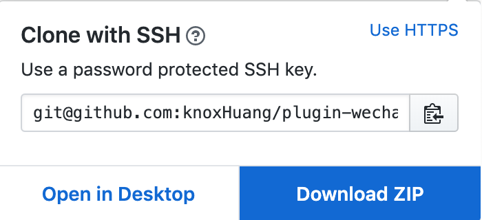

## 什么是引擎插件？

引擎插件是微信小游戏新增的附加功能。当小游戏首次启动时，如果本地已经存在相同引擎插件，可直接复用相同版本的引擎或增量更新引擎，减少所需下载量，从而提升小游戏启动速度。

## 使用说明

### 1. 安装 Cocos Creator 构建插件

目前 Cocos Creator 需要安装一个专用的构建插件，此构建插件面向 Cocos Creator 2.0.5 ~ 2.2.0 版本，用于帮助用户在构建中自动生成微信小游戏引擎分离所需的文件结构与配置。

Cocos Creator 2.2.1 的版本和以后版本将会内置该功能到编辑器中，无需再使用该插件。

**插件下载**：

地址：https://github.com/knoxHuang/plugin-wechat-engine-separation

**插件安装：**

* 应用于全局（所有项目）下：只需要将插件文件夹存放到 用户 /.CocosCreator/packages 下即可
* 应用于单个项目下：只需要将插件文件夹存放到与 assets 文件同级的 packages 文件夹下（如果没有可以自行创建一个）

### 2.  发布

安装插件以后，重启 Cocos Creator，即可在构建发布完成后自动进行适配，无需其他操作。
之后如需禁用引擎插件功能，直接删除此插件即可。

## FAQ

* 问：开放数据域能使用该功能吗？
答：目前微信不支持。

* 问：启用引擎插件后，是否仍然会把引擎代码算入首包包体中？
答：仍然会计算在内，但是玩家加载游戏时会优先读取本地相同版本的引擎插件，从而减少下载量。

* 问：引擎插件功能是否支持自定义引擎？
答：不支持，构建时如果版本不匹配或者启用了自定义引擎，将会提示报错信息。

* 问：Cocos Creator 2.2.0 版本引擎插件不支持 iOS 9 ？
答：由于 Cocos Creator 2.2.0 版本对 iOS9 有一些兼容问题，所以相同版本的引擎插件也会有相同问题，不过后续会在 2.2.1 中进行完善修复

## 参考资料

[微信小游戏引擎插件接入文档](https://developers.weixin.qq.com/minigame/dev/guide/base-ability/game-engine-plugin.html)