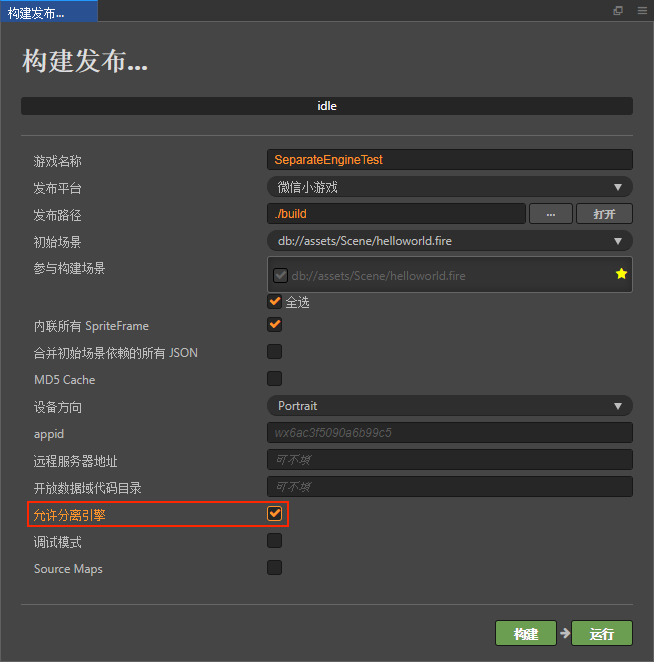

# Cocos Creator 游戏引擎插件使用说明

游戏引擎插件是微信 7.0.7 版本新增的一项功能。此插件内置了 Cocos Creator 引擎的官方版本，若玩家首次体验的游戏中启用了此插件，则所有同样启用此插件的游戏，都无需再次下载 Cocos Creator 引擎，只需直接使用公共插件库中的相同版本引擎，或者增量更新引擎即可。

例如，当一个玩家玩过了由 Cocos Creator 2.2.0 开发的 A 游戏，里面已启用了此插件。然后他又玩了同样是 2.2.0 开发的 B 游戏，如果 B 游戏也启用了此插件，那么就无需重新下载 Cocos Creator 引擎。即使 B 使用的是 2.2.1 的 Cocos Creator，微信也只需要增量更新引擎两个版本的差异部分。这样就可以大幅减少小游戏的下载量，提升小游戏启动速度 0.5 - 2s，获得更好的用户体验。

## 使用说明

Cocos Creator 提供了强大的集成式游戏开发环境，使用引擎插件非常简单。

### Cocos Creator 2.2.1 及以上版本

在 Cocos Creator 新版本中已集成此插件。只需在构建发布面板中，勾选 **允许分离引擎**，然后正常构建发布即可，**无需其它人工操作**。（此功能仅在非调试模式生效）

### Cocos Creator 老版本

一、下载 Cocos Creator 构建插件

地址：https://github.com/cocos-creator/plugin-wechat-engine-separation/archive/master.zip

二、安装插件

* 如需应用于全局（所有项目）下：将解压后的插件文件夹拷贝到 `C:\Users\用户\.CocosCreator\packages`（Windows）或者 `用户/.CocosCreator/packages`（Mac）下即可。
* 如需应用于单个项目：将解压后的插件文件夹拷贝到项目工程中与 assets 文件夹同级的 packages 文件夹下（如果没有可以自行创建一个）。

三、构建

安装插件以后，重启 Cocos Creator，在构建发布面板中执行正常构建即可，**无需其它人工操作**。（此功能仅在非调试模式生效）
之后如需禁用引擎插件功能，直接删除此插件即可。

## 参考链接

 - 如有其它疑问，请参考 [Cocos Creator 微信小游戏引擎插件说明文档](https://github.com/cocos-creator/creator-docs/blob/master/zh/publish/wechat-engine-plugin.md)
 - 更多技术细节，请参考 [微信小游戏引擎插件官方说明](https://developers.weixin.qq.com/minigame/dev/guide/base-ability/game-engine-plugin.html)
